Step 1 — Installing Apache and PHP-FPM

bopiz@lab:~$sudo apt update

bopiz@lab:~$sudo apt install apache2 php-fpm

bopiz@lab:~$wget https://mirrors.edge.kernel.org/ubuntu/pool/multiverse/liba/libapache-mod-fastcgi/libapache2-mod-fastcgi_2.4.7~0910052141-1.2_amd64.deb

bopiz@lab:~$sudo dpkg -i libapache2-mod-fastcgi_2.4.7~0910052141-1.2_amd64.deb

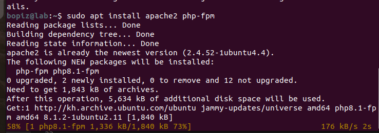

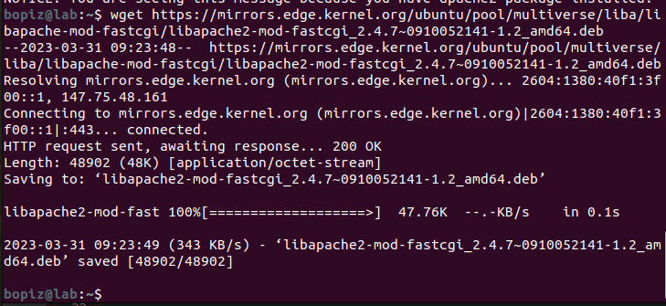

- Step 2 — Configuring Apache and PHP-FPM

bopiz@lab:~$sudo mv /etc/apache2/ports.conf /etc/apache2/ports.conf.default

bopiz@lab:~$echo "Listen 8080" | sudo tee /etc/apache2/ports.conf

bopiz@lab:~$sudo a2dissite 000-default

bopiz@lab:~$sudo cp /etc/apache2/sites-available/000-default.conf /etc/apache2/sites-available/001-default.conf

bopiz@lab:~$sudo nano /etc/apache2/sites-available/001-default.conf

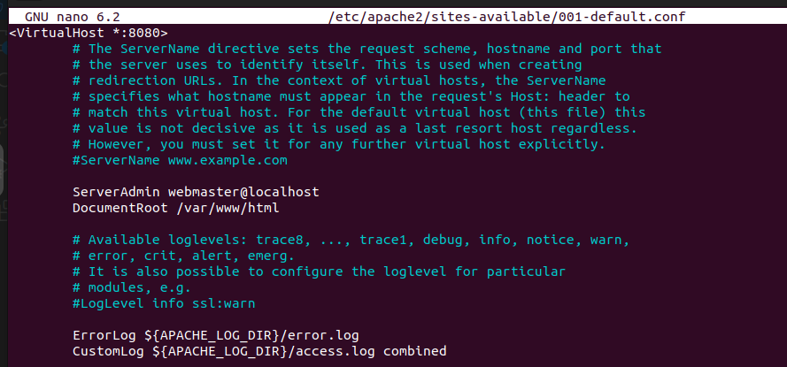

bopiz@lab:~$sudo a2ensite 001-default

bopiz@lab:~$sudo systemctl reload apache2

bopiz@lab:~$sudo netstat -tlpn

- Step 3 — Configuring Apache to Use mod_fastcgi

bopiz@lab:~$sudo a2enmod actions

bopiz@lab:~$sudo a2enmod actions

bopiz@lab:~$sudo mv /etc/apache2/mods-enabled/fastcgi.conf /etc/apache2/mods-enabled/fastcgi.conf.default

bopiz@lab:~$sudo nano /etc/apache2/mods-enabled/fastcgi.conf

bopiz@lab:~$sudo apachectl -t

bopiz@lab:~$sudo systemctl reload apache2

- Step 4 — Verifying PHP Functionality

bopiz@lab:~$echo "<?php phpinfo(); ?>" | sudo tee /var/www/html/info.php

bopiz@lab:~$sudo ufw allow 8080

bopiz@lab:~$sudo ufw allow "Apache Full"

bopiz@lab:~$sudo ufw status

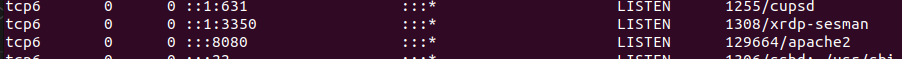

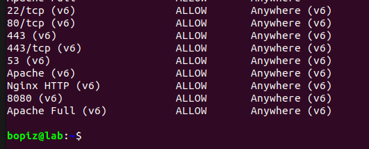

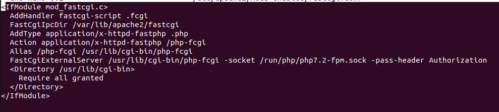

- Step 5 — tao VHosts for Apache

bopiz@lab:~$ sudo nano /etc/apache2/sites-available/wordpress.conf

bopiz@lab:~$ sudo nano /etc/apache2/sites-available/laravel.conf

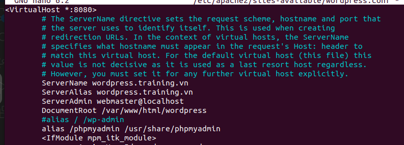

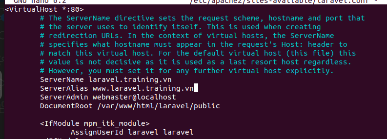

bopiz@lab:~$sudo apachectl -t

bopiz@lab:~$sudo systemctl reload apache2

- Step 6 — Installing and Configuring Nginx

bopiz@lab:~$sudo apt install nginx

bopiz@lab:~$sudo rm /etc/nginx/sites-enabled/default

bopiz@lab:~$sudo mkdir -v /usr/share/nginx/wordpress.training.vn /usr/share/nginx/laravel.training.vn

bopiz@lab:~$echo "< h1 style='color: green;'>wordpress.training.vn</h1>" | sudo tee /usr/share/nginx/wordpress.training.vn/index.html

bopiz@lab:~$echo "< h1 style='color: red;'>laravel.training.vn</h1>" | sudo tee /usr/share/nginx/laravel.training.vn/index.html

bopiz@lab:~$echo "<?php phpinfo(); ?>" | sudo tee /usr/share/nginx/wordpress.training.vn/info.php

bopiz@lab:~$echo "<?php phpinfo(); ?>" | sudo tee /usr/share/nginx/laravel.training.vn/info.php

bopiz@lab:~$sudo nano /etc/nginx/sites-available/wordpress.training.vn

bopiz@lab:~$sudo nano etc/nginx/sites-available/laravel.training.vn

bopiz@lab:~$sudo ln -s /etc/nginx/sites-available/wordpress.training.vn /etc/nginx/sites-enabled/wordpress.training.vn

bopiz@lab:~$sudo ln -s /etc/nginx/sites-available/laravel.training.vn /etc/nginx/sites-enabled/laravel.training.vn

- Step 7 — Configuring Nginx for Apache’s Virtual Hosts

bopiz@lab:~$sudo nano /etc/nginx/sites-available/apache

bopiz@lab:~$sudo ln -s /etc/nginx/sites-available/apache /etc/nginx/sites-enabled/apache

bopiz@lab:~$sudo nginx -t

bopiz@lab:~$sudo systemctl reload nginx

- Step 8 — Installing and Configuring mod_rpaf

bopiz@lab:~$sudo apt install unzip build-essential apache2-dev

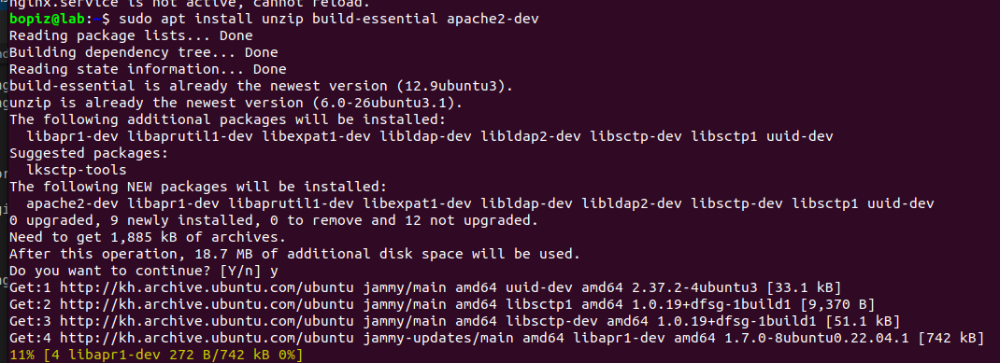

bopiz@lab:~$wget https://github.com/gnif/mod_rpaf/archive/stable.zip

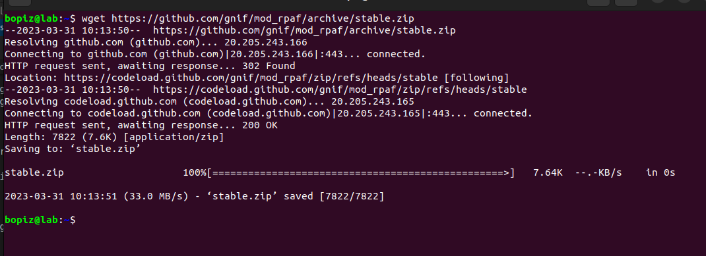

bopiz@lab:~$unzip stable.zip

bopiz@lab:~$cd mod_rpaf-stable

bopiz@lab:~$make

bopiz@lab:~$sudo make install

bopiz@lab:~$sudo nano /etc/apache2/mods-available/rpaf.load

LoadModule rpaf_module /usr/lib/apache2/modules/mod_rpaf.so

bopiz@lab:~$sudo nano /etc/apache2/mods-available/rpaf.conf

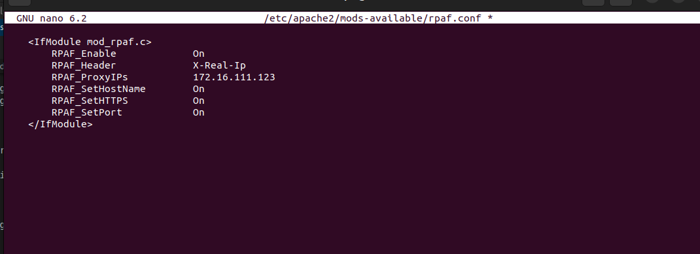

bopiz@lab:~$sudo a2enmod rpaf

bopiz@lab:~$sudo apachectl -t

bopiz@lab:~$sudo systemctl reload apache2

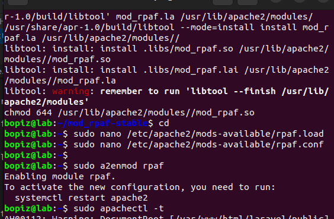

- Step 9 — Setting Up HTTPS Websites with Let’s Encrypt

bopiz@lab:~$sudo nano /etc/nginx/sites-available/apache

bopiz@lab:~$sudo add-apt-repository ppa:certbot/certbot

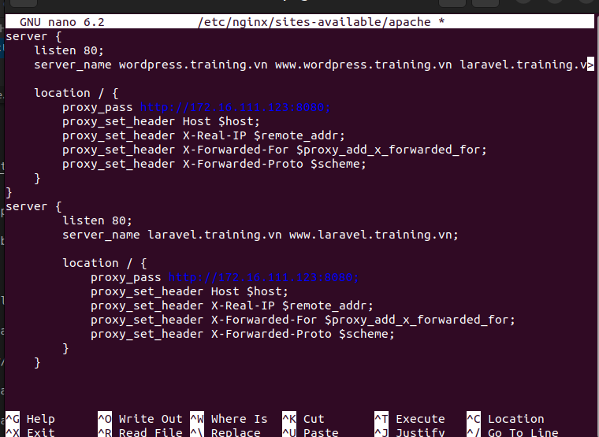

bopiz@lab:~$sudo apt update

bopiz@lab:~$sudo apt install python-certbot-nginx

bopiz@lab:~$sudo certbot --nginx -d wordpress.training.vn -d www.wordpress.training.vn

bopiz@lab:~$sudo certbot --nginx -d laravel.training.vn -d www.laravel.training.vn

- Step 10 — Blocking Direct Access to Apache

bopiz@lab:~$sudo iptables -I INPUT -p tcp --dport 8080 ! -s 172.16.111.123 -j REJECT --reject-with tcp-reset

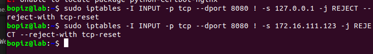

- Step 11 — Serving Static Files Using Nginx

bopiz@lab:~$sudo nano /etc/nginx/sites-available/apache

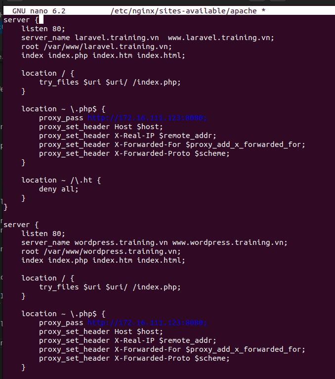

bopiz@lab:~$sudo nginx -t

bopiz@lab:~$sudo service nginx reload

bopiz@lab:~$sudo tail -f /var/log/apache2/other_vhosts_access.log

source wordpress,laravel

Install wordpress and laravel on apache2

Creat user and database for wordpress

Log in Mariadb server: mysql -u root -p

CREATE DATABASE wordpress;

GRANT ALL PRIVILEGES on wordpress.* to 'luan'@'localhost' identified by 'minhluan';

FLUSH PRIVILEGES;

exit;

Install wordpress

bopiz@lab:/tmp$ curl -O https://wordpress.org/latest.tar.gz

bopiz@lab:/tmp$ tar xzvf latest.tar.gz

bopiz@lab: sudo nano wp-example-config.php

sudo systemctl restart mysql

sudo systemctl restart apache2

set up virtual host for wordpress root@lab:/# sudo nano /etc/apache2/sites-available/wordpress.conf

sudo nano /etc/apache2/sites-available/wordpress.conf

bopiz@lab:/$ sudo ln -s /etc/apache2/site-available/wordpress.conf /etc/apache2/site-enabled

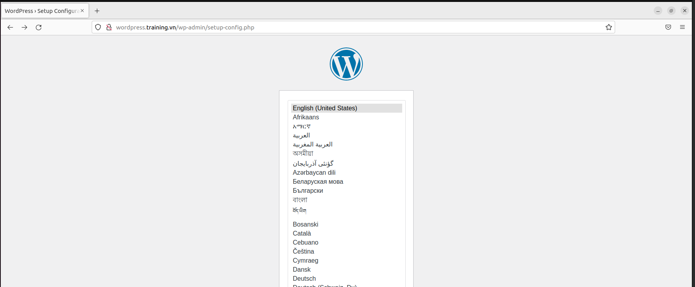

The first installl composer

curl -sS https://getcomposer.org/installer | php

sudo mv composer.phar /usr/local/bin/composer

sudo chmod +x /usr/local/bin/composer

After install composer successful, get install laravel by composer

composer create-project --prefer-dist laravel/laravel laravel

Set up and install laravel creat APP_KEY for project Laravel

sudo php artisan key:generate

Create user and databse for laravel

This is the same as config and create database for wordpress

Log in Mariadb server: mysql -u root -p

bopiz@lab:mysql -u root -p

Create user and database for wordpress follow command line:

CREATE DATABASE laravel;

GRANT ALL PRIVILEGES on laravel.* to 'user'@'localhost' identified by 'minhluan';

FLUSH PRIVILEGES;

exit;

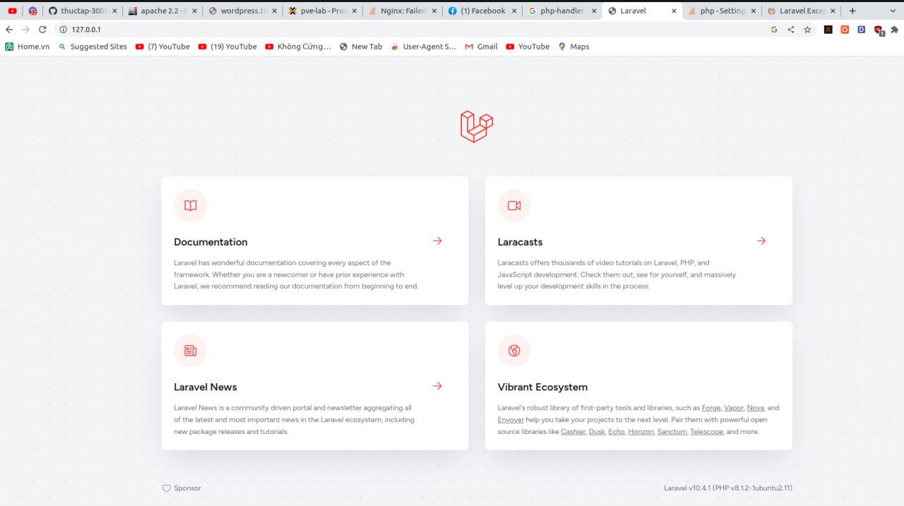
