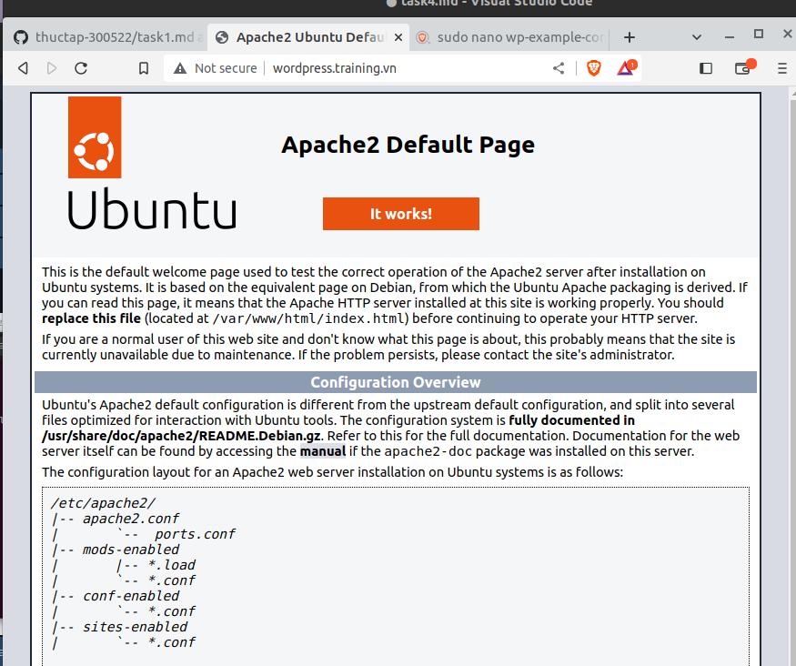
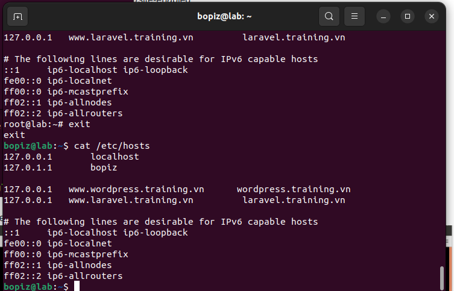
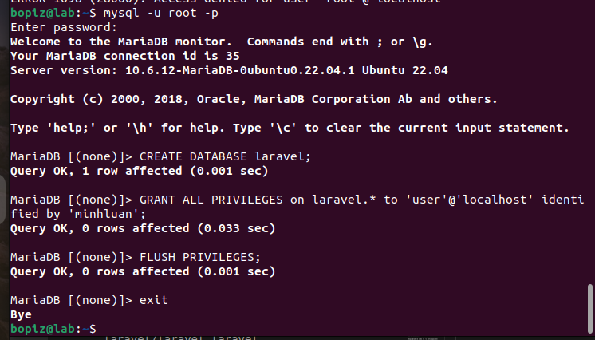
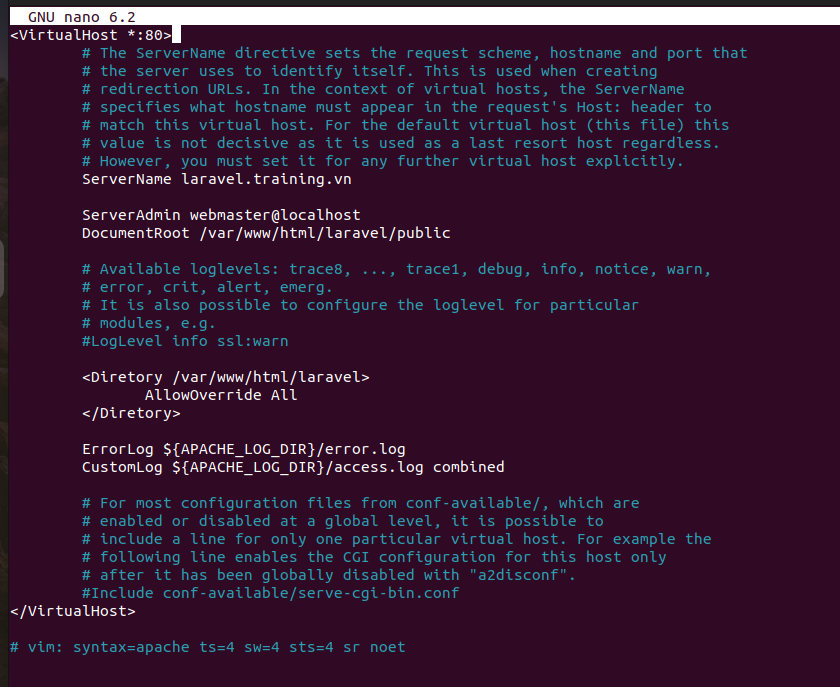
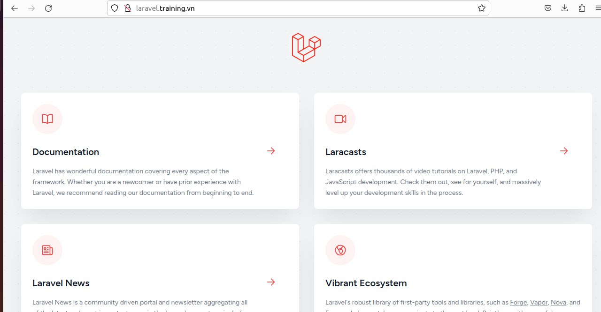
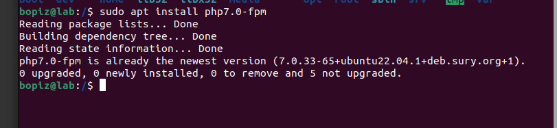
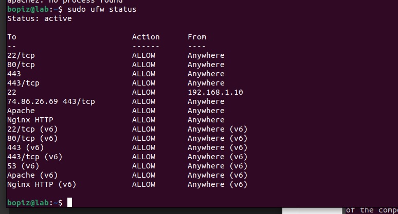
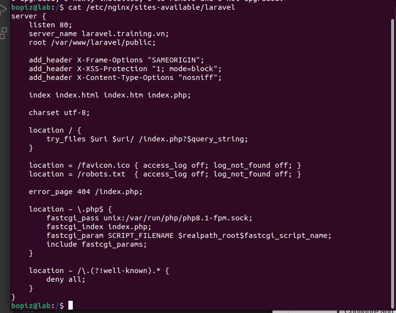
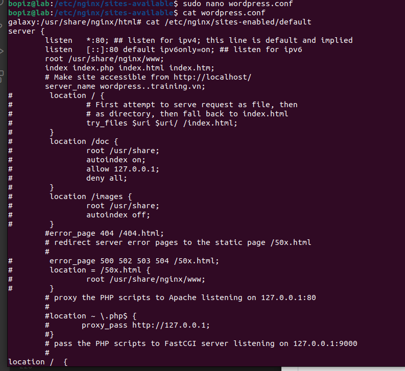
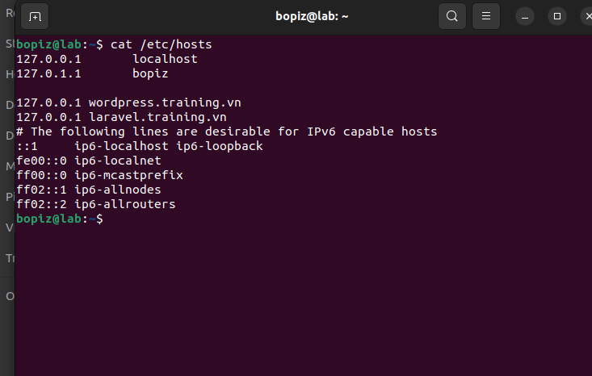

- LAMP stack :  build wordpress/laravel webiste trên chính mô hình trên

Disable firewall

- sudo apache2ctl configtest

- sudo sytemctl restart apache2

- sudo ufw app list

Install Apache2

- sudo apt-get install apache2 -y

Enable and start service apache2

- sudo systemctl enable apache2

- sudo systemctl start apache2

bopiz@lab:/$ sudo systemctl status apache2

[sudo] password for bopiz: 

● apache2.service - The Apache HTTP Server
     
     Loaded: loaded (/lib/systemd/system/
     
     apache2.service; enabled; vendor prese>
     
     Active: active (running) since Fri 
     
     2023-03-24 16:27:38 +07; 18min ago
     
       Docs: https://httpd.apache.org/docs/2.4/
    
    Process: 864212 ExecStart=/usr/sbin/apachectl start (code=exited, status=0/>
   
   Main PID: 864217 (apache2)
   
      Tasks: 8 (limit: 18999)
   
     Memory: 18.2M

Check apache2 on web browse

IP 127.0.0.1

---

Install MariaDB

sudo apt-get install mariadb-server -y

Enable and start service

bopiz@lab:/$ service mysql status

● mariadb.service - MariaDB 10.6.12 

database server

     Loaded: loaded (/lib/systemd/system/
     
     mariadb.service; enabled; vendor prese>
     
     Active: active (running) since Fri 
     
     2023-03-24 16:27:32 +07; 21min ago
     
       Docs: man:mariadbd(8)
     
             https://mariadb.com/kb/en/library/systemd/

sudo systemctl start mysql

Check status of service mysql

service mysql status

Install PHP 

sudo apt-get install php -y

Check php have been instaled on OS

bopiz@lab:/$ php -v

PHP 8.2.4 (cli) (built: Mar 16 2023 14:34:48) (NTS)

Copyright (c) The PHP Group

Zend Engine v4.2.4, Copyright (c) Zend Technologies

---

Install packet of php

sudo apt-get install libapache2-mod-php -y

Creat file info.php in folder /var/www/html and write it

bopiz@lab:/$ cat /var/www/html/info.php

hi

bopiz@lab:/$ 

---

- Install wordpress and laravel on apache2

-Creat user and database for wordpress

Log in Mariadb server: mysql -u root -p

reate user and database for wordpress follow command line:

CREATE DATABASE wordpress

GRANT ALL PRIVILEGES on wordpress.* to 'luan'@'localhost' identified by 'minhluan';

FLUSH PRIVILEGES;

exit

Install Extension for php

 Install wordpress

 Download source code: curl -O https://wordpress.org/latest.tar.gz

 bopiz@lab:/tmp$ curl -O https://wordpress.org/latest.tar.gz

unzip this file lastest.tar.gz

bopiz@lab:/tmp$ tar xzvf latest.tar.gz

- Set up file config wp-example-config.php in wordpress

sudo nano wp-example-config.php

- Save and exit After that restart some service

sudo systemctl restart mysql

sudo systemctl restart apache2

- Set up virtual host for wordpress

root@lab:/# sudo nano /etc/apache2/sites-available/wordpress.conf

sudo nano /etc/apache2/sites-available/wordpress.conf

bopiz@lab:/$ sudo ln -s /etc/apache2/site-available/wordpress.conf /etc/apache2/site-enabled

          

Install Laravel

The first installl composer

curl -sS https://getcomposer.org/installer | php

sudo mv composer.phar /usr/local/bin/composer

sudo chmod +x /usr/local/bin/composer

After install composer successful, get install laravel by composer

composer create-project --prefer-dist laravel/laravel laravel

Set up and install laravel creat APP_KEY for project Laravel

sudo php artisan key:generate

Create user and databse for laravel

This is the same as config and create database for wordpress

Log in Mariadb server: mysql -u root -p

Create user and database for wordpress follow command line:

CREATE DATABASE laravel

GRANT ALL PRIVILEGES on laravel.* to 'user'@'localhost' identified by 'minhluan';

FLUSH PRIVILEGES;

exit

2. LEMP stack: wordpress and laravel in ubuntu 22.04

LEMP stack, wordpress and vhost in ubuntu 22.04

- Update sudo and Install nginx

sudo mkdir /var/www/wordpress.training.vn

sudo mkdir /var/www/laravel.training.vn

sudo chown -R $USER:$USER /var/www/wordpress.training.vn

sudo chown -R $USER:$USER /var/www/laravel.training.vn

sudo nano /etc/nginx/sites-available/wordpress.training.vn

sudo nano /etc/nginx/sites-available/laravel.training.vn

sudo unlink /etc/nginx/sites-enabled/default

sudo nginx -t

sudo ln -s /etc/nginx/sites-available/wordpress.training.vn /etc/nginx/sites-enabled/

php

ufw status

configure and Install vhost Laravel

configure and Install vhost wordpress

check domain

Check file /etc/hosts

