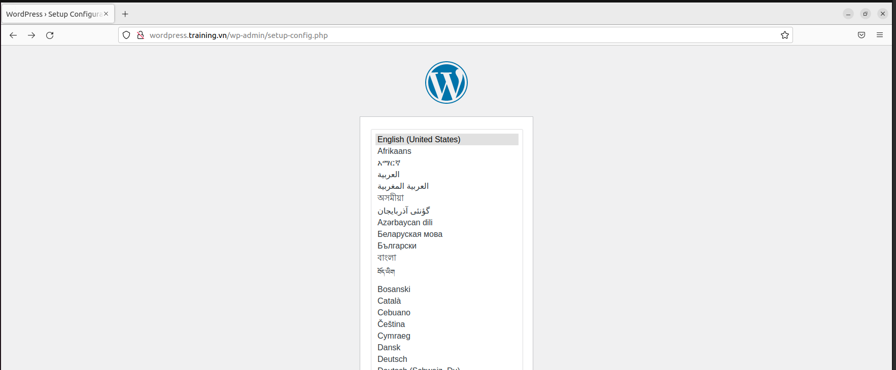
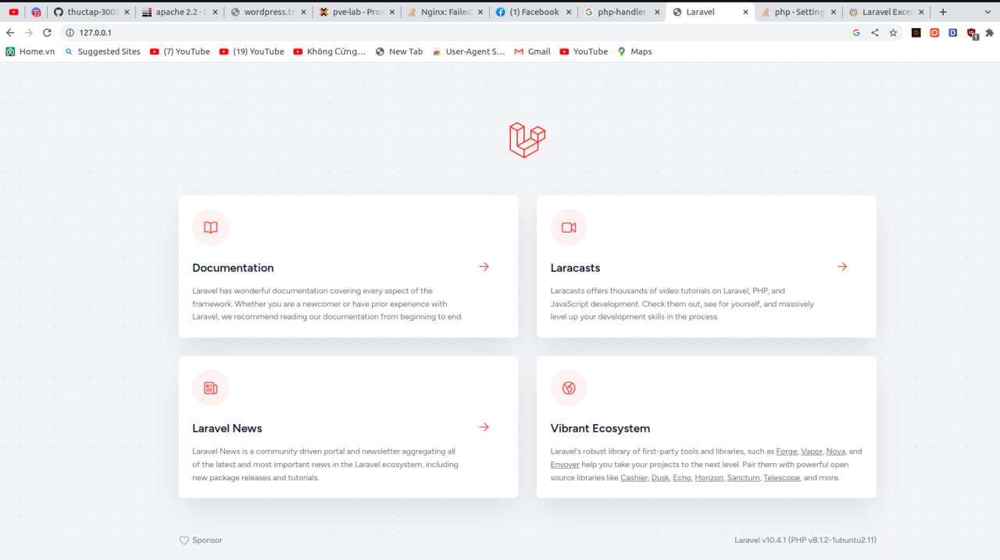

1.Reverse proxy

cài đặt nginx trên ubuntu để setup reverse proxy

sudo apt install nginx -y

Set up reverser proxy on nginx

2. Mysql

Theo mặc định, giá trị này được đặt thành 127.0.0.1, có nghĩa là máy chủ sẽ chỉ tìm kiếm các kết nối cục bộ. Bạn chỉ cần thay đổi thị trường này để tham khảo địa chỉ IP bên ngoài

Chỉnh sửa cấu hình tệp trong sudo nano /etc/mysql/mariadb.conf.d/50-server.cnf

bopiz@lab:~$ sudo nano /etc/mysql/mariadb.conf.d/50-server.cnf

Thay đổi ip local 127.0.0.1 thành ip_server_mysql hoặc 0.0.0.0

Create user for remote mysql

sudo mysql -u root -p

mysql> CREATE USER 'remotemysql'@'172.16.111.123' IDENTIFIED BY 'minhluan';

mysql> GRANT ALL on *.* TO 'remotemysql'@'172.16.111.123' WITH GRANT OPTION;

mysql>FLUSH PRIVILEGES;

mysqp -u user -h database_server_ip -p 

exit

Open port 3306 - the port default of MySQL - which to allow traffic to MySQL

sudo ufw allow from remote_IP to any port 3306

3. Vsftpd

Install vsftpd by command: sudo apt-get install vsftpd

- Creat the file backup and edit finf vsftpd.conf by command:

sudo cp /etc/vsftpd.conf /etc/vsftpd.conf.bak

sudo nano /etc/vsftpd.conf

anonymous_enable=NO

local_enable=YES

write_enable=YES

allow_writeable_chroot=YES

chroot_local_user=YES

local_umask=022

userlist_deny=NO

userlist_enable=YES

userlist_file=/etc/vsftpd.allowed_users

- Create the files to allow user coonect ftp :

sudo touch /etc/vsftpd.allowed_users

Add user for FTP:

sudo useradd ftpuser

sudo passwd 123

Add user to file user_list to access:

echo 'ftpuser' | sudo tee -a /etc/vsftpd.allowed_users

Creat a folder for the new user

sudo mkdir -p /home/ftpuser/ftp/test

sudo chmod 550 /home/ftpuser/ftp/

sudo chmod 750 /home/ftpuser/ftp/test

sudo chown -R ftpuser: /home/ftpuser/ftp/

4. Phpmyadmin

Creat user for phpmyadmin on databases mysql

CREATE DATABASE phpmyadmin;

GRANT ALL PRIVILEGES on phpmyadmin.* TO 'phpmyadmin'@'localhost' IDENTIFIED BY 'luanminh';

FLUSH PRIVILEGES;

exit

Install phpmyadmin by command: sudo apt install phpmyadmin

Install wordpress and laravel on apache2

Creat user and database for wordpress

Log in Mariadb server: mysql -u root -p

CREATE DATABASE wordpress;

GRANT ALL PRIVILEGES on wordpress.* to 'luan'@'localhost' identified by 'minhluan';

FLUSH PRIVILEGES;

exit;

Install wordpress

bopiz@lab:/tmp$ curl -O https://wordpress.org/latest.tar.gz

bopiz@lab:/tmp$ tar xzvf latest.tar.gz

bopiz@lab: sudo nano wp-example-config.php

sudo systemctl restart mysql

sudo systemctl restart apache2

set up virtual host for wordpress
root@lab:/# sudo nano /etc/apache2/sites-available/wordpress.conf

sudo nano /etc/apache2/sites-available/wordpress.conf

bopiz@lab:/$ sudo ln -s /etc/apache2/site-available/wordpress.conf /etc/apache2/site-enabled

- Laravel

The first installl composer

curl -sS https://getcomposer.org/installer | php

sudo mv composer.phar /usr/local/bin/composer

sudo chmod +x /usr/local/bin/composer

After install composer successful, get install laravel by composer

composer create-project --prefer-dist laravel/laravel laravel

Set up and install laravel creat APP_KEY for project Laravel

sudo php artisan key:generate

Create user and databse for laravel

This is the same as config and create database for wordpress

Log in Mariadb server: mysql -u root -p

Create user and database for wordpress follow command line:

CREATE DATABASE laravel

GRANT ALL PRIVILEGES on laravel.* to 'user'@'localhost' identified by 'minhluan';

FLUSH PRIVILEGES;

exit

kiểm tra lại phpmyadmin trên web

Set up user and group for web laravel and wordpress

Trong file config của web server laravrel: ghi nội dung AssignUserId: laravel laravel vào file /etc/apache2/site-available/laravel.conf

Trong file config của web server wordpress: ghi nội dung AssignUserId: wordpress wordpress vào file /etc/apache2/site-available/wordpress.conf

Để kiểm tra kết quả sau khi setup config, trong document root của web server, tạo file info.php và ghi nội dung bên dưới vào:

'<php? system("id"); ?>'

sau đó nhập domain để có thể kiểm tra được

- wordpress

- laravel

done! goodluck have fun :D
