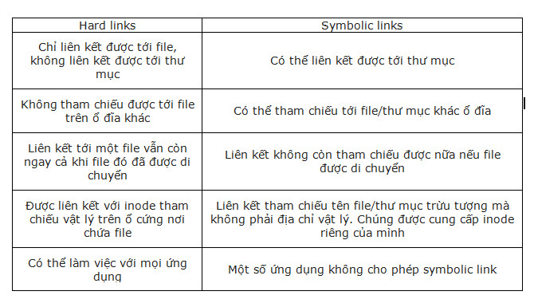

Heading 1 	Xem dung lượng disk

Xem dung lượng ổ đĩa đã sử dụng

Heading 2  Xem các phân vùng

Xem phân vùng ổ đĩa sda,sdb

Heading 3 Xem cpu, ram, network

Heading 3.1 Xem CPU 

Kiểm tra thông số cpu

Heading 3.2 Xem RAM 

Kiểm tra dung lượng và bộ nhớ RAM

Heading 3.3 Xem Card mạng(Network)

Kiểm tra trạng thái dịch vụ Network

Kiểm tra trạng thái các card đang kết nối

Kiểm tra danh sách card mạng đang kết nối

Heading 4 Theo dõi chi tiết tiến trình

Kiểm tra tiến trình đang hoạt động

Kiểm tra thông số tíến trình

Heading 5 Liệt kê danh sách file/thư mục

Liệt kê tập tin/thư mục

Liệt kê chi tiết quyền tập tin/thư mục

Heading 6 Tìm kiếm, copy, di chuyển,... file/thư mục

Copy file/thư mục

Di chuyển file/thư mục

Tìm kiếm file/thư mục

Heading 7 Phân quyền cơ bản và phân quyền nâng cao

Phân quyền cơ bản, chỉ cho admin chỉnh sửa và truy cập

Phân quyền tập tin/thư mục thuộc nhóm

Heading 8 Làm quen với trình editor vim, vi,...

Sử dụng vi và vim để truy cập trình editor

Heading 9 Mount và Unmount

Tạo Mount và Unmont

Heading 10 Symbolic Links

Tạo Symbolic Links

Heading 11 Hard Links
 
Tạo Hardlink thư mục/tập tin

**Sự khác nhau giữa hardlink và symbolic link**

Hard links

-	Chỉ liên kết được tới file, không liên kết được tới thư mục
-	Không tham chiếu được tới file trên ổ đĩa khác
-	Liên kết tới một file vẫn còn ngay cả khi file đó đã được di chuyển
-	Được liên kết với inode tham chiếu vật lý trên ổ cứng nơi chứa file
-	Có thể làm việc với mọi ứng dụng

Symbolic links
-	Có thể liên kết được tới thư mục
-	Có thể tham chiếu tới file/thư mục khác ổ đĩa
-	Liên kết không còn tham chiếu được nữa nếu file được di chuyển
-	Liên kết tham chiếu tên file/thư mục trừu tượng mà không phải địa chỉ vật lý. Chúng được cung cấp inode riêng của mình
-	Một số ứng dụng không cho phép symbolic link

Heading 12 Nén, giải nén

Nén 

Giải nén

Heading 13 Đo lượng băng thông sử dụng (traffic inbound, outbound)

Kiểm tra lưu lượng hệ thống đang sử dụng

Kiểm tra lưu lượng sử dụng trong giờ

Kiểm tra lưu lượng sử dụng trong ngày

Kiểm tra lưu lượng sử dụng cao nhất

Thống kê lưu lượng theo thời gian thực

Heading 14 nmap, telnet, ping, ssh, copy file/thư mục từ local đến public host 

Sử dụng Nmap quét nhanh

Sử dụng telnet

Ping 

Sử dụng ssh 

Heading 15 SSH gen key

Tạo SSH gen key connection server SSH

Heading 16 Xem file không dùng Editor

Sử dụng Head và Tail để xem file

Heading 17 Đổ nội dung 1 chuỗi vào cuối file

Sử dụng toán tử >> để đổ nội dung vào file 

Heading 18 find, grep, awk, sed, tr, head, tail, less, more, sort, uniq, cut, join, diff, xargs, traceroute, netstat, kill, pkill, wc, wget, git, rsyn, ping, tee, ln, mkdir

Tìm kiếm bằng find

Tìm kiếm bằng grep

Sử dụng awk để in nội dung 

Sử dụng sed in ra số dòng

Sử dụng tr trans văn bản 

Sử dụng Head và Tail để xem file đầu cuối

Sử dụng less

Sử dụng more

Sử dụng sort để sắp xếp 

Sử dụng uniq

Sử dụng cut 

Sử dụng join

Sử dụng diff 

Sử dụng xargs

Sử dụng traceroute xem đường đi network

Sử dụng netstat kiểm tra cổng truy cập/kết nối

Sử dụng kill và pkill để tắt tiến trình

Sử dụng wc đếm số dòng trong text

Sử dụng wget

Sử dụng git

Sử dụng rsync

Sử dụng ping

Sử dụng tee

Sử dụng ln 

Sử dụng mkdir và rm

Heading 19 Standard Input,Output, Error.

Standard Input
Thiết bị vào tiêu chuẩn (standard input device) còn được gọi là stdin, là thiết bị mà nó nhận đầu vào (input). 

Standard Output

Trong terminal, đầu ra tiêu chuẩn (standard output) được mặc định cho màn hình (screen) của người dùng (user).
Standard output còn được gọi là stdout là file descriptor mặc định một tiến trình (process) trình có thể ghi đầu ra (output).

Standard Error

Standard Error hay còn được gọi là những lỗi tiêu chuẩn. Đây là những lỗi có sẵn trong hệ thống. Lỗi này thường được các lập trình viên sử dụng để đánh giá, kiểm tra phần mềm. 

Heading 20 Redirecting Standard Output,Retrdireacting Standard Error

Một chương trình chạy trên Linux sẽ gửi đầu ra vào một file đặc biệt là stdout (standard output) và error messages đến stderr (standard error). Hai file này được link đến màn hình và không được save lại trong file.Rediretion cho phép chúng ta thay đổi nơi output ra và nơi input đến.Thay vì xuất ra màn hình (terminal), output có thể ghi vào tập tin, hoặc truyền cho process khác xử lý tiếp,Thay vì xuất thông tin lỗi ra màn hình, thì chuyển hướng lỗi giúp xuất thông tin lỗi ra tệp tin.

Heading 21 /dev/null

“/dev/null” là một file thiết bị ảo. Đối với các chương trình có liên quan, chúng được coi như những file thực sự. Các tiện ích có thể yêu cầu dữ liệu từ loại nguồn này và hệ điều hành sẽ cung cấp dữ liệu cho chúng. Nhưng, thay vì đọc từ ổ đĩa, hệ điều hành sẽ tạo ra dữ liệu này một cách linh hoạt. 

Một số câu lệnh /dev/null : 

grep -r power /sys/

grep -r power /sys/ 2>/dev/null

ping google.com 1>/dev/null

grep -r power /sys/ >/dev/null 2>&1

    Với 2> bạn chuyển hướng thông báo lỗi tiêu chuẩn. Ví dụ: 2>/dev/null hoặc 2>/home/user/error.log.
    Với 1> bạn chuyển hướng đầu ra tiêu chuẩn.
    Với &> bạn chuyển hướng cả lỗi tiêu chuẩn và đầu ra tiêu chuẩn.

Heading 22 Redirecting Standard Input

Chuyển hướng đầu ra tiêu chuẩn dành cho thiết bị.Dữ liệu truyền vào để process xử lý, có thể là dữ liệu nhập từ bàn phím, tập tin, hay ouput của process khác.
