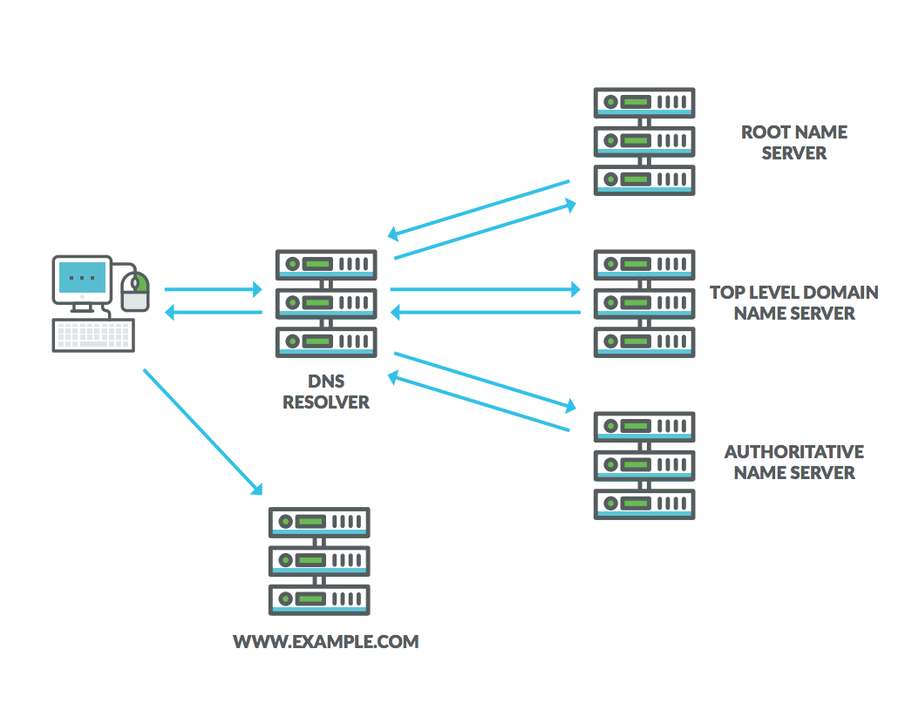
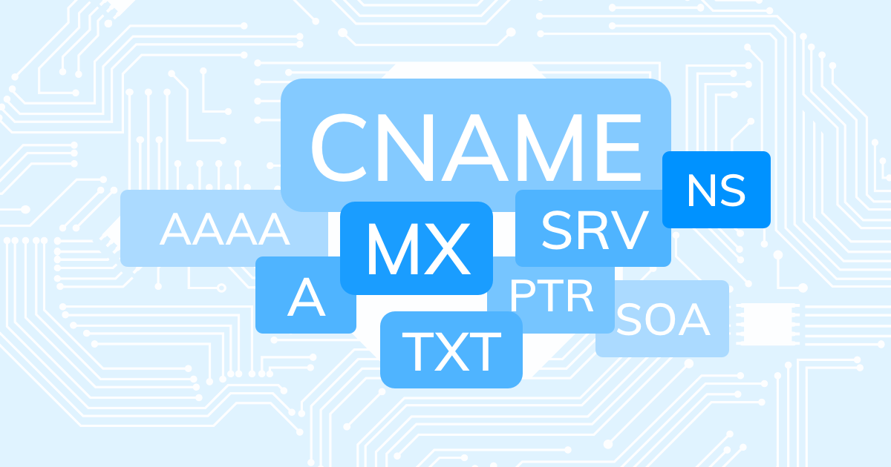
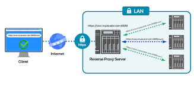
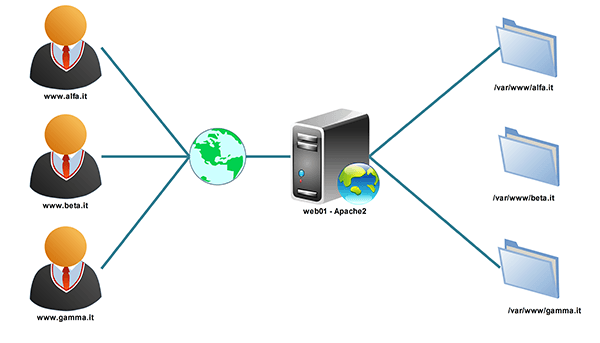

1. SSL và các thuật ngữ, vấn đề liên quan

SSL là tiêu chuẩn của công nghệ bảo mật, truyền thông mã hoá giữa máy chủ Web server và trình duyệt. Tiêu chuẩn này hoạt động và đảm bảo rằng các dữ liệu truyền tải giữa máy chủ và trình duyệt của người dùng đều riêng tư và toàn vẹn. SSL hiện tại cũng là tiêu chuẩn bảo mật cho hàng triệu website trên toàn thế giới, nó bảo vệ dữ liệu truyền đi trên môi trường internet được an toàn.

SSL đảm bảo rằng tất cả các dữ liệu được truyền giữa các máy chủ web và các trình duyệt được mang tính riêng tư, tách rời.

2. Một số định nghĩa, thuật ngữ thường gặp về SSL

Domain Validation (DV SSL)

Chứng thư số SSL chứng thực cho Domain Name – Website. Khi 1 Website sử dụng DV SSL thì sẽ được xác thực tên domain, website đã được mã hoá an toàn khi trao đổi dữ liệu.

Organization Validation (OV SSL)

Chứng thư số SSL chứng thực cho Website và xác thực doanh nghiệp đang sở hữu website đó .

Extended Validation (EV SSL)

Cho thấy Website đang sử dụng chứng thư SSL có độ bảo mật cao nhất và được rà soát pháp lý kỹ càng.

Subject Alternative Names (SANs SSL)

Nhiều tên miền hợp nhất trong 1 chứng thư số:

    Một chứng thư số SSL tiêu chuẩn chỉ bảo mật cho duy nhất một tên miền đã được kiểm định. Lựa chọn thêm SANs chỉ với chứng thư duy nhất bảo đảm cho nhiều tên miền con. SANs mang lại sự linh hoạt cho người sử dụng, dễ dàng hơn trong việc cài đặt, sử dụng và quản lý chứng thư số SSL. Ngoài ra, SANs có tính bảo mật cao hơn Wildcard SSL, đáp ứng chính xác yêu cầu an toàn đối với máy chủ và làm giảm tổng chi phí triển khai SSL tới tất cả các tên miền và máy chủ cần thiết.
    Chứng thư số SSL SANs có thể tích hợp với tất cả các loại chứng thư số SSL của GlobalSign bao gồm:Chứng thực tên miền (DV SSL),Chứng thực tổ chức doanh nghiệp (OV SSL)và Chứng thực mở rộng cao cấp (EV SSL).

Wildcard SSL Certificate (Wildcard SSL)

Sản phẩm lý tưởng dành cho các cổng thương mại điện tử. Mỗi e-store là một sub-domain và được chia sẻ trên một hoặc nhiều địa chỉ IP. Khi đó, để triển khai giải pháp bảo bảo mật giao dịch trực tuyến (đặt hàng, thanh toán, đăng ký & đăng nhập tài khoản,…) bằng SSL, có thể dùng duy nhất một chứng chỉ số Wildcard cho tên miền chính của website và tất cả sub-domain.

3. Domain là gì?

Domain hay tên miền là địa chỉ trang web hoạt động trên Internet. Nơi mà mọi người sử dụng để search trên trình duyệt để truy cập vào một website bất kỳ. Domain được thể hiện bằng các ký tự hoặc chữ số trong bảng chữ cái thay cho địa chỉ IP của máy chủ.

4. DNS là gì? 1 số record của DNS.

DNS là viết tắt của cụm từ Domain Name System, mang ý nghĩa đầy đủ là hệ thống phân giải tên miền. DNS được phát minh vào năm 1984 cho Internet, chỉ một hệ thống cho phép thiết lập tương ứng giữa địa chỉ IP và tên miền.

DNS record là bản ghi nằm trong DNS servers cung cấp thông tin về cơ sở dữ liệu DNS, cho biết các tên miền, địa chỉ IP gắn với tên miền và cách xử lý các yêu cầu với tên miền đó… Tất cả các tên miền trên internet đều phải có một vài bản ghi DNS cần thiết để người dùng có thể truy cập trang web khi nhập tên miền và thực hiện các mục đích khác.

Một số loại record của DNS

A record (viết tắt của Address record) là DNS record cơ bản và quan trọng nhất dùng để truy cập web. Nó giúp trỏ tên miền (domain) của website tới một địa chỉ IP cụ thể. 

CNAME (Canonical Name) record là một bản ghi DNS record quy định một tên miền là bí danh của một tên miền chính khác. Một tên miền chính có thể có nhiều bí danh CNAME.

MX (Mail Exchange) record là một DNS record giúp xác định mail server mà email sẽ được gửi tới. Một tên miền có thể có nhiều MX record, điều này giúp tránh việc không nhận được email nếu một mail server ngưng hoạt động.

TXT record là một loại DNS record giúp tổ chức các thông tin dạng text (văn bản) của tên miền. Một domain (tên miền) có thể có nhiều bản ghi TXT và chúng chủ yếu được dùng cho các Sender Policy Framework (SPF) codes, giúp email server xác định các thư được gửi đến có phải từ một nguồn đáng tin hay không. Ngoài ra, loại bản ghi DNS này còn dùng để xác thực máy chủ của một tên miền, xác minh SSL...

NS (Name Server) record là một loại DNS record giúp xác định thông tin của một tên miền cụ thể được khai báo và quản lý trên máy chủ nào.

PTR (Pointer) record có thể nói là một DNS record ngược lại với A record, cho phép chuyển đổi từ địa chỉ IP sang tên miền. Bản ghi PTR giúp xác thực IP của các hostname gửi tới, giúp hạn chế bị spam mail…

5. Hosting, vps, server là gì?

Hosting hay Web hosting là không gian lưu trữ được chia nhỏ từ server giúp đăng tải dữ liệu, xuất bản website, hoặc ứng dụng trên internet. Khi sử dụng hệ thống hosting,đặt lên server (hay còn gọi là máy chủ) của nhà cung cấp các tệp dữ liệu cần thiết để website hay ứng dụng online chạy được.

VPS là viết tắt của Virtual Private Server hay còn gọi là máy chủ riêng ảo. VPS được tạo ra bằng phương pháp phân chia một máy chủ vật lý thành nhiều máy chủ khác nhau có tính năng tương tự như một máy chủ riêng chạy dưới dạng chia sẻ tài nguyên từ máy chủ vật lý ban đầu đó.

Máy chủ (Server) là một máy tính được kết nối với mạng máy tính hoặc Internet, có IP tĩnh, có năng lực xử lý cao. Trên đó người ta cài đặt các phần mềm để phục vụ cho các máy tính khác truy cập để yêu cầu cung cấp các dịch vụ và tài nguyên.

6. Reverse proxy là gì, nguyên lý hoạt động?

Reverse proxy là một loại proxy server trung gian giữa một máy chủ và các clients gửi tới các yêu cầu. Nó kiểm soát yêu cầu của các clients, nếu hợp lệ, sẽ luân chuyển đến các servers thích ứng. Reverse proxy là một trung gian cho các máy chủ liên hệ với nó được liên lạc bởi bất kỳ clients nào. 

Khi các máy tính đó thực hiện yêu cầu đến các trang web và dịch vụ trên Internet, Proxy server sẽ chặn các yêu cầu đó và sau đó giao tiếp với web server thay mặt cho các máy khách đó, giống như một người trung gian.

Thông thường, tất cả các yêu cầu từ D sẽ chuyển trực tiếp đến F và F sẽ gửi phản hồi trực tiếp đến D. Với reverse proxy, tất cả các yêu cầu từ D sẽ chuyển trực tiếp đến E và E sẽ gửi yêu cầu của nó đến và nhận phản hồi từ F. E sẽ sau đó chuyển các câu trả lời thích hợp cho D.

7. Vhost là gì? Vhost hoạt động thế nào?

Virtual Hosts là một phương thức lưu trữ cho phép lưu nhiều tên miền khác nhau trên cùng một máy chủ Server. Virtual Hosts có thể được xem như một giải pháp cho phép nhúng rất nhiều tên miền trên một địa chỉ IP của một Server duy nhất. Tùy vào cách cài đặt, Server sẽ tự hiểu tên miền nào đang hoạt động bên trong vị trí lưu trữ của Server. 

Có nhiều cách khác nhau để xác định cấu hình của một Virtual Host, nhưng cách được sử dụng thông dụng ngày nay là:

    IP Based.
    Port – Based.
    Name Based.

IP Based

IP-Based Virtual Hosts (xác định website dựa theo IP): Đây là phương pháp đơn giản nhất trong 3 phương pháp, Một IP sử dụng cho 1 Website. Máy chủ web sẽ chịu trách nhiệm ánh xạ IP được yêu cầu có đế đến đúng website mong muốn hay không. Vì thế, mỗi trang web sẽ được định nghĩa bởi 1 IP duy nhất nhằm tránh những vấn đề không đáng có cho trang web liên quan đến địa chỉ IP. Tuy nhiên IP-Based (dùng trên 1 máy chủ) cần thiết lập Virtual Interface trên 1 máy chủ để có thể sử dụng được nhiều IP.

Port Based

Port Based tương đương với IP-Based, nhưng sự khác biệt ở phương thức này là có thể quản lý nhiều trang web dựa theo số Port được định nghĩa cùng với IP hoặc tên miền. Ngoài ra, Port sử dụng tránh lặp lại với Port được mặc định của ứng dụng khác khi đang hoạt động.

Name Based

Name Based (xác định website dựa theo tên – Domain Name): Nhiều website sử dụng chung 1 IP. Server sẽ đối chiếu http header từ client yêu cầu để ánh xạ đến đúng website được chỉ định theo Domain. Cho nên, Name-Based rất được ưa thích trong việc quản lý nhiều trang web trên cùng 1 máy chủ và trước tình trạng thế giới đang dần cạn kiệt IP Public, đồng thời sử dụng tối đa tài nguyên hiện có. Hạn chế lớn nhất khi dùng IP chung, nếu gặp vấn đề thì tất cả các trang web đều sẽ bị ảnh hưởng theo.

8. So sánh giữa Nginx và Apache? 

8.1 Hiệu suất

8.1.1 Web tĩnh

Nginx nhanh hơn 2,5 lần Apache dựa trên một thử nghiệm kiểm chuẩn chạy tới 1000 kết nối đồng thời.

Trong một thử nghiệm khác với 512 kết nối đồng thời, Nginx nhanh hơn khoảng 2 lần và và tiêu thụ ít bộ nhớ hơn (4%).

8.1.2 Web động

Đối với các trang web động bằng WordPress, Joomla, Drupal, ... có thể cân nhắc sử dụng NGINX hoặc Apache vì cả 2 gần như tương đương nhau.Vì hầu hết các request đang xử lý trong PHP runtime environment khá giống nhau cho cả hai web server.

8.2 Hệ điều hành hỗ trợ

Apache hoạt động trên tất cả các loại hệ thống Unix-like (Linux hoặc BSD) và hỗ trợ đầy đủ cho Microsoft Windows.

Nginx cũng chạy trên một vài hệ thống trong số chúng và cũng hỗ trợ Window tuy nhiên hiệu suất không được mạnh bằng.

8.3 Bảo mật

Cả Nginx và Apache đều rất coi trọng tính bảo mật trên trang web của mình. Không có hệ thống mạnh mẽ nào mà lại không có những biện pháp đối phó với các cuộc tấn công DDoS, phần mềm độc hại và phishing. Cả hai máy chủ này định kỳ phát hành báo cáo bảo mật và những tư vấn, đảm bảo rằng khía cạnh bảo mật được tăng cường ở mọi cấp độ.

8.4 Hỗ trợ & Tài liệu

Apache sở hữu mạng lưới hỗ trợ cộng đồng lớn thông qua mailing lists, IRC và Stack Overflow. Ngoài ra, còn có tùy chọn hỗ trợ bên thứ ba từ OpenLogic.

Tương tự, Nginx cũng có hỗ trợ thông qua mailing lists, IRC và Stack Overflow. Nginx còn có một sản phẩm có tên Nginx + có hỗ trợ riêng của Google bao gồm nhiều tính năng hơn.

Cả Nginx và Apache đều cung cấp tài liệu, bao gồm hầu hết mọi chủ đề và tính năng cần thiết. Tài liệu này bao gồm release notes, user guides, tutorials... Nginx thậm chí có wiki riêng!

8.5 Tính linh hoạt

Một máy chủ web phải đủ linh hoạt để cho phép các tùy chỉnh. Apache làm điều đó khá tốt, thông qua việc sử dụng các công cụ .htaccess mà Nginx không hỗ trợ. Nó cho phép phân cấp nhiệm vụ admin. Admin bên thứ ba và admin cấp hai có thể bị ngăn truy cập vào máy chủ chính. Hơn nữa, Apache hỗ trợ hơn 60 mô-đun, giúp nó có khả năng mở rộng cao. Đó là lý do tại sao Apache phổ biến hơn với các nhà cung cấp dịch vụ hosting chia sẻ.