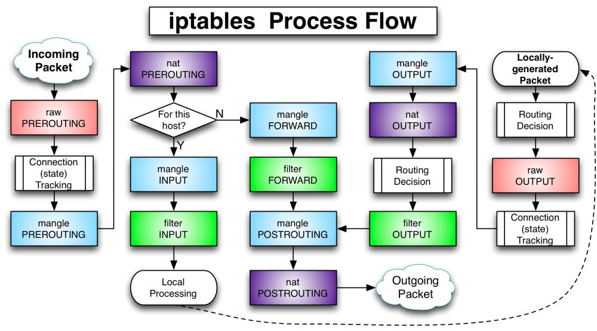
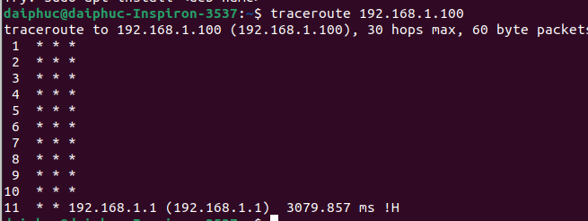
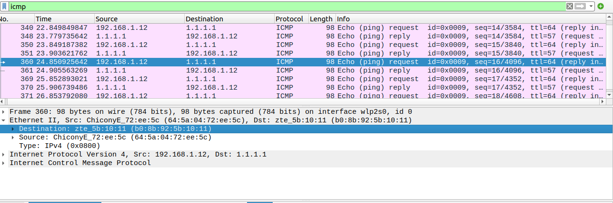
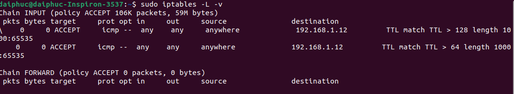
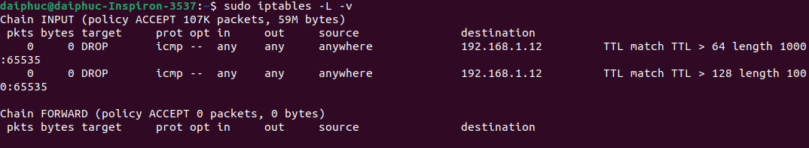
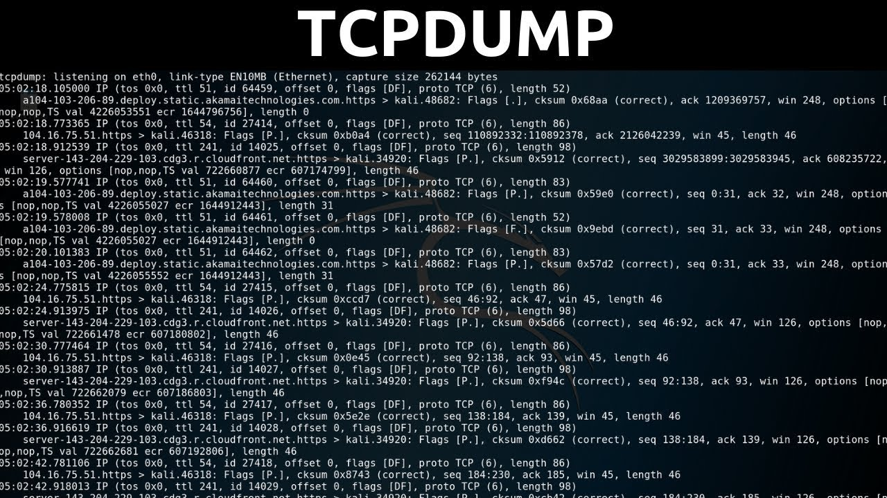

1. Viết markdown report về :iptables packet flow diagram

Table

- Filter table: Table này nhằm quyết định liệu gói tin có được chuyển đến địa chỉ đích hay không.

- Mangle table: Table này dùng vào việc sửa head của gói tin, ví dụ chỉnh sửa giá trị các trường TTL, MTU, Type of Service.

- Table Nat: Table cho phép route các gói tin đến các host khác nhau trong mạng NAT table cách thay đổi IP nguồn và IP đích của gói tin. Table này cho phép kết nối đến các dịch vụ không được truy cập trực tiếp được do đang trong mạng NAT.

- Table raw: 1 gói tin có thể thuộc một kết nối mới hoặc cũng có thể là của 1 một kết nối đã tồn tại. Table raw cho phép làm việc với gói tin trước khi kernel kiểm tra trạng thái gói tin.

Chains

- Chain PREROUTING: Các rule thuộc chain này sẽ được áp dụng ngay khi gói tin vừa vào đến Network interface. Chain này chỉ có ở table NAT, raw và mangle.

- Chain INPUT: Các rule thuộc chain này áp dụng cho các gói tin ngay trước khi các gói tin được vào hệ thống. Chain này có trong 2 table mangle và filter.

- Chain OUTPUT: Các rule thuộc chain này áp dụng cho các gói tin ngay khi gói tin đi ra từ hệ thống. Chain này có trong 3 table là raw, mangle và filter.

- Chain FORWARD: Các rule thuộc chain này áp dụng cho các gói tin chuyển tiếp qua hệ thống. Chain này chỉ có trong 2 table mangle và table.

- Chain POSTROUTING: áp dụng cho các gói tin đi network interface. Chain này có trong 2 table mangle và NAT.

*Giải thích: 

+ Gói tin có destination là IP server thì đi như thế nào.

Nếu Destination IP là địa chỉ IP Server, máy chủ sẽ trả lời với địa chỉ MAC của máy tính và phản hồi về cho máy gửi ARP Request.

+ Gói tin từ server đi ra như thế nào.

Một gói tin ARP Request đính kèm Destination IP sẽ được gửi Broadcast tới tất cả các máy trong mạng cục bộ.

+ Gói tin có destination là IP không phải của server, thì server xử lý như nào.

Nếu Destination IP là địa chỉ IP không phải của Server và mạng cục bộ, Server sẽ sử dụng Default gateway cũng như Subnet mask để xác định được Gateway địa chỉ cần gửi và gửi gói tin đến đây.

2. Viết markdown report: Demo sử dụng module TRACE để theo dõi gói tin trong hai kịch bản

 - Theo dõi gói SYN, từ IP công ty đến máy ảo lab, đi như thế nào.

 Các gói tin đi từ địa chỉ IP nguồn sẽ đến Gateway của router sau đó đi tiếp đến địa chỉ IP đích
 
 

- Theo dõi gói icmp từ máy ảo ping đi 1.1.1.1 đi như thế nào.

Gói tin sẽ gửi request đến nguồn 1.1.1.1 sau đó chờ phản hồi. Khi đã phản hồi thì Server nguồn sẽ reply lại các gói request.

3. Đọc/hiểu được iptables rules căn bản để debug lỗi liên quan network cho VPS/Server của KH (debug network sử dụng công cụ tcpdump), cấu hình một số ví dụ:

 + Cho phép/Chặn IPX truy cập đến IP dest A.B.C.D port YYY

Tạo rule chặn IP máy thật ssh đến máy ảo 

sudo iptables -A INPUT -s 0/0 -d 192.168.82.128 -p TCP --dport 22 -j DROP

(chặn tất cả IP truy cập đến IP đích thông qua cổng 22)

Tạo rule cho phép IP máy thật ssh đến máy ảo 

sudo iptables -A INPUT -s 0/0 -d 192.168.82.128 -p TCP --dport 22 -j ACCEPT

(cho phép tất cả IP truy cập đến IP đích qua cổng 22)

 + Cho phép/Chặn tất cả ip mới truy cập đến IP dest A.B.C.D port YYY

Tạo rule chặn tất cả ip nguồn truy cập đến des 192.168.1.12(ip máy tính)

sudo iptables -A INPUT -d 192.168.1.12 -p icmp -j DROP

Tạo rule cho phép tất cả ip mới truy cập đến IP des 192.168.1.12(ip máy tính)

sudo iptables -A INPUT -d 192.168.1.12 -p icmp -j ACCEPT

 + Cho phép/Chặn ip Y.J.K.F truy cập đến IP dest A.B.C.D port YYY với TTL 128,64 và Length 1000

 Tạo rule cho phép ipx truy cập đích ip des với ttl 64,128 và độ dài 1000

 sudo iptables -A INPUT -s 192.168.1.12 -d 192.168.82.128 -m ttl --ttl-gt 64,128 -m length --length 1000:65535 -p icmp -j ACCEPT

Tạo rule chặn ipx truy cập đích ip des với ttl 64,128 và độ dài 1000

 sudo iptables -A INPUT -s 192.168.1.12 -d 192.168.82.128 -m ttl --ttl-gt 64,128 -m length --length 1000:65535 -p icmp -j DROP

 + Đặt comment cho 1 iptables rules bất kỳ.

 Tạo comment cho 1 rule chặn các gói dữ liệu TCP đến từ card mạng eth1

 iptables -A INPUT -i eth1 -m comment --comment "my LAN - " -p TCP -j DROP

 

4. Tìm hiểu về công cụ tcpdump, những options có thể dùng để debug network.

TCPDUMP là công cụ hữu ích được ra đời và phát triển để phục vụ cho mục đích hỗ trợ phân tích các gói dữ liệu mang theo dòng lệnh đồng thời cho phép khách hàng thực hiện việc chặn, lọc và hiển thị các gói tin TCP/IP được truyền đi hoặc nhận trên một mạng có sự tham gia của máy tính.

Các option debug netowrk thường gặp 
-i: Khi khách hàng muốn chụp các gói tin trên một interface được chỉ định thì các option này sẽ được sử dụng.
D: Khi option này được sử dụng, TCPDUMP sẽ tiến hành liệt kê ra toàn bộ các interface đang hiện đang tồn tại trên máy tính mà nó có thể capture được.
-c N : Sau khi capture nhiều gói tin, TCPDUMP sẽ dừng hoạt động khi bạn sử dụng option này.
-n: Khi sử dụng option này, TCPDUMP sẽ không thực hiện việc phân giải từ địa chỉ IP sang hostname.
-nn: Tương tự như option –n, TCPDUMP sẽ không tiến hành phân giải từ địa chỉ IP sang hostname mà nó cũng không phân giải cả portname.
-v: Option này sẽ giúp người dùng gia tăng số lượng thông tin về gói tin thậm chí có thể tăng thêm với option –vv hoặc –vvv mà họ có thể nhận được.
-s: Với option này, các định nghĩa snap length (kích thước) gói tin sẽ lưu lại, để mặc định, người dùng phải sử dụng 0.
-w filename: TCPDUMP khi sử dụng option này sẽ capture các packet và lưu xuống file chỉ định.
-r filename: Option này được sử dụng đi kèm với option –w với mục đích sử dụng là đọc nội dung file đã lưu từ trước.
-x: Dữ liệu của gói tin capture sẽ được hiển thị dưới dạng mã Hex.
-A: Các packet được capture được hiển thị dưới dạng mã ACSII.
-S: Khi TCPDUMP capture packet, các số sequence number ACK sẽ được chuyển đổi thành các relative sequence number hay relative ACK. Nếu sử dụng option –S này thì TCPDUMP sẽ không tiến hành chuyển đổi nữa mà sẽ để mặc định.
-F filename: Các packet với các luật đã được định trước trong tập tin filename sẽ được Filter bởi TCPDUMP.
-e: Thay vì hiển thị địa chỉ IP của người gửi và người nhận, TCPDUMP khi sử dụng option này sẽ thay thế các địa chỉ IP nói trên bằng địa chỉ MAC.
-t: TCPDUMP khi sử dụng option này sẽ bỏ qua thời gian bắt được gói tin khi thực hiện việc hiển thị cho khách hàng.
-tt: Thời gian hiển thị trên mỗi dòng lệnh sẽ không được format theo dạng chuẩn khi TCPDUMP sử dụng option này.
-K: TCPDUMP sẽ bỏ qua việc checksum các gói tin.
-N: TCPDUMP với option này sẽ không tiến hành in các quality domain name ra màn hình.
-B size: TCPDUMP thường sử dụng option này để cài đặt buffer_size .
-L: Danh sách các data link type mà interface hỗ trợ sẽ được hiển thị với option này.
-y: Lựa chọn data link type khi bắt các gói tin.