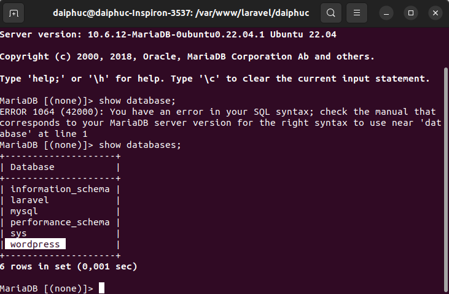
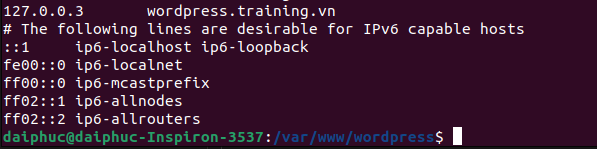
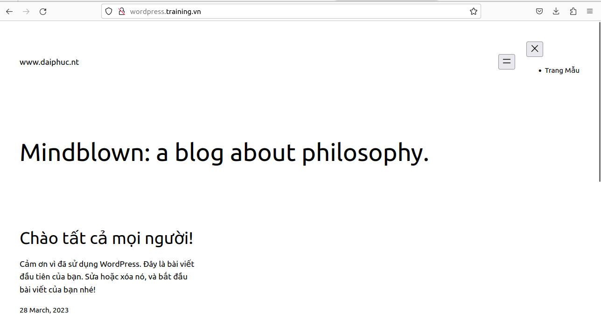
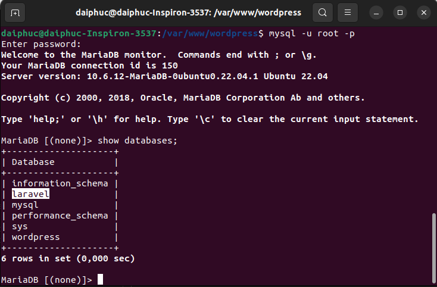
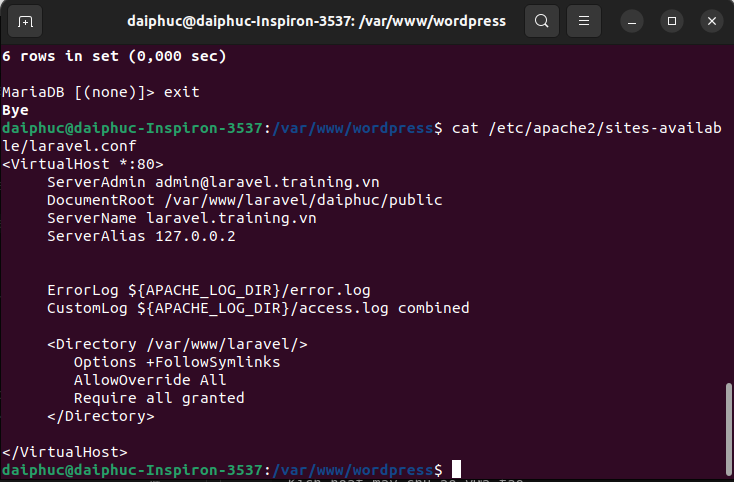
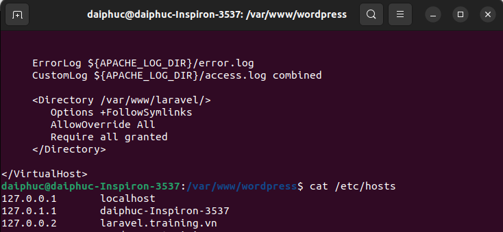
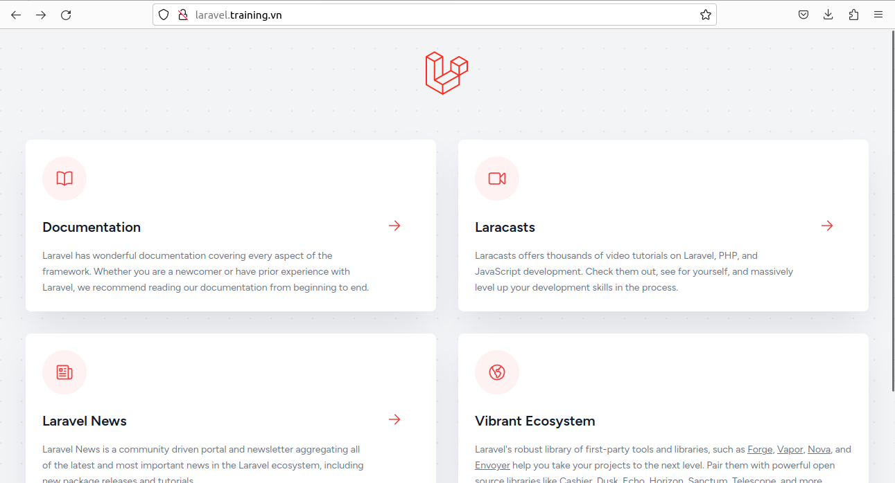
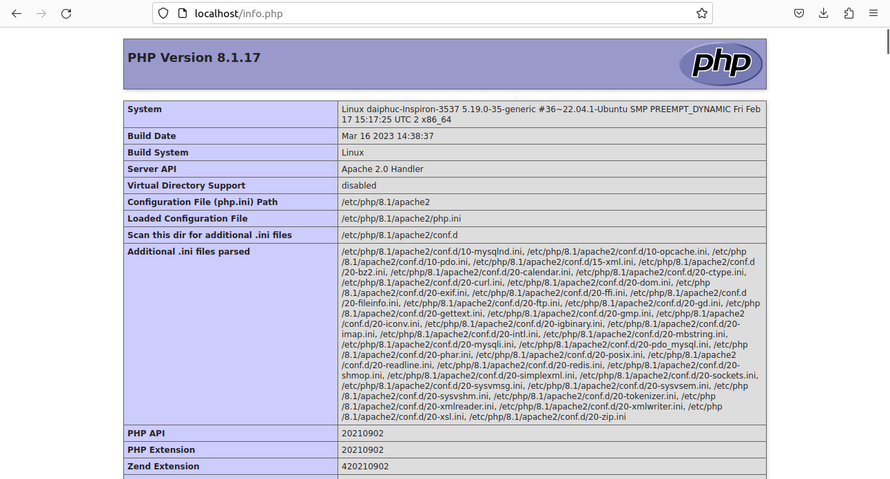

**Lamp Stack
1. cài wordpress

- CÀI ĐẶT APACHE và MARIADB trên Ubuntu

sudo apt update

sudo apt install apache2

sudo systemctl start apache2.service

sudo systemctl enable apache2.service

sudo apt install mariadb-server mariadb-client

sudo systemctl start mariadb.service

sudo systemctl enable mariadb.service

sudo mysql_secure_installation

(Enter current password for root (enter for none): nhấn Enter

Set root password? [Y/n]: Y

New password: nhập vào password mới mà bạn muốn đặt

Re-enter new password: nhập lại giống password bạn vừa tạo ở trên

Remove anonymous users? [Y/n]: Y

Disallow root login remotely? [Y/n]: Y

Remove test database and access to it? [Y/n]: Y

Reload privilege tables now? [Y/n]: Y)

sudo add-apt-repository ppa:ondrej/php -y && apt update && apt install 

php8.2-fpm php8.2-common php8.2-mysql php8.2-xml php8.2-xmlrpc php8.2-curl php8.2-gd php8.2-imagick 

php8.2-cli php8.2-dev php8.2-imap php8.2-mbstring php8.2-soap php8.2-zip 

php8.2-bcmath -y && sed -i 's/;cgi.fix_pathinfo=1/cgi.fix_pathinfo=0/g' /etc/php/8.2/fpm/php.ini && service 

php8.2-fpm restart && apt install apache2 -y && chown -R www-data:www-data /var/www/ && chmod -R 755 /var/www/

- Tạo DATABASE trên MARIADB và Reset lại dịch vụ apache

sudo mysql -u root -p

CREATE DATABASE wordpress;

CREATE USER 'wordpressuser'@'localhost' IDENTIFIED BY '123456';

GRANT ALL ON wordpress.* TO 'wordpressuser'@'localhost' WITH GRANT OPTION;

FLUSH PRIVILEGES;

EXIT;

sudo systemctl restart apache2.service

- Tải Wordpress

cd /tmp

wget https://wordpress.org/latest.tar.gz

tar xvaf latest.tar.gz

sudo mv wordpress /var/www/wordpress

- Phân quyền

sudo chown -R www-data:www-data /var/www/wordpress/

sudo chmod -R 755 /var/www/wordpress/

- Cấu hình Apache2 và WordPress

sudo nano /etc/apache2/sites-available/wordpress.conf

(<VirtualHost *:80>

ServerAdmin admin@wordpress.training.vn

DocumentRoot /var/www/wordpress

ServerName wordpress.training.vn

ServerAlias 127.0.0.3

<Directory /var/www/wordpress/>

Options +FollowSymlinks

AllowOverride All

Require all granted

</Directory>

ErrorLog ${APACHE_LOG_DIR}/error.log

CustomLog ${APACHE_LOG_DIR}/access.log combined

</VirtualHost>)

- Sửa file wp.config

cd /var/www/wordpress

sudo mv wp-config-sample.php wp-config.php

sudo nano wp-config.php

define( 'DB_sAME', 'wordpress' );

define( 'DB_USER', 'wordpressuser );

define( 'DB_PASSWORD', '123456' );

define( 'DB_HOST', 'localhost' );

- Khởi động lại dịch vụ apache

sudo a2ensite wordpress.conf

sudo a2enmod rewrite

sudo systemctl restart apache2.service

- Chỉnh sửa /etc/hosts để đọc domain

127.0.0.3 wordpress.training.vn

+ KẾT QUẢ 

2. cài laravel

-Bước 1: Cập nhật hệ thống

sudo apt update -y && apt upgrade -y
    

Bước 2: Cài đặt PHP & PHP extensions

sudo apt-get install php libapache2-mod-php php-dev php-zip php-curl php-pear php-mbstring php-mysql php-gd php-xml curl -y
    

- Kiểm tra xem PHP đã được cài đặt thành công chưa

php -v

Bước 3: Cài đặt máy chủ web Apache

sudo apt install apache2

sudo systemctl start apache2

sudo systemctl enable apache2
    

Bước 4: Tạo Cơ sở dữ liệu cho Ứng dụng Laravel

sudo apt install mariadb-server -y

sudo mysql_secure_installation

sudo mysql -u root -p

MariaDB [(none)]> create database laravel;

MariaDB [(none)]> grant all privileges on laravel.* to 'laravel'@'localhost' identified by 'mypassword';

MariaDB [(none)]> flush privileges;

MariaDB [(none)]> exit;
    

Bước 5: Cài đặt Composer

curl -sS https://getcomposer.org/installer | php

sudo mv composer.phar /usr/local/bin/composer

sudo chmod +x /usr/local/bin/composer

- Kiểm tra xem Composer đã được cài đặt thành công chưa

composer --version

Bước 6: Cài đặt Laravel Framework

sudo mkdir /var/www/laravel

cd /var/www/laravel

composer create-project laravel/laravel daiphuc --prefer-dist
    
cd daiphuc

php artisan

- Phân quyền thư mục dự án thành www-data (người dùng Apache).

sudo chown -R www-data:www-data /var/www/laravel
sudo find /var/www/laravel/ -type d -exec chmod 755 {} \;
sudo find /var/www/laravel/ -type f -exec chmod 644 {} \;

    

Bước 7: Tạo Máy chủ ảo cho Ứng dụng Laravel

nano /etc/apache2/sites-available/laravel.conf

<VirtualHost *:80>
     ServerAdmin admin@azdigi.space
     DocumentRoot /var/www/laravel/daiphuc/public
     ServerName laravel.training.vn
     ServerAlias  127.0.0.2

     ErrorLog ${APACHE_LOG_DIR}/error.log
     CustomLog ${APACHE_LOG_DIR}/access.log combined

     <Directory /var/www/laravel/>
        Options +FollowSymlinks
        AllowOverride All
        Require all granted
     </Directory>

</VirtualHost>

- Kích hoạt máy chủ ảo vừa tạo

sudo a2ensite laravel.conf

systemctl reload apache2

sudo a2enmod rewrite

systemctl reload apache2
    

- Khởi động lại Apache

sudo systemctl restart apache2
    

Bước 8: Trỏ etc/hosts để nhận domain

127.0.0.2 laravel.training.vn

+ KẾT QUẢ

**Lemp Stack

Cài đặt LEMP trên Ubuntu 20
1. Bước 1: Cập nhật Software Packages

sudo apt update

sudo apt upgrade -y

2. Bước 2: Cài đặt Nginx

- Cài đặt Nginx

sudo apt install curl gnupg2 ca-certificates lsb-release -y

echo "deb http://nginx.org/packages/ubuntu `lsb_release -cs` nginx" | sudo tee /etc/apt/sources.list.d/nginx.list

Nhập Nginx key  chính thức để apt có thể xác minh tính xác thực của các gói:

curl -fsSL https://nginx.org/keys/nginx_signing.key | sudo apt-key add -

Xác minh tính hợp lệ của Nginx key:

sudo apt-key fingerprint ABF5BD827BD9BF62

Tiến hành cài đặt

sudo apt update

sudo apt install nginx -y

- Cấu hình tường lửa

sudo ufw allow http

sudo ufw allow https

- Kiểm tra máy chủ web

sudo systemctl start nginx

systemctl status nginx

- Quản lý Nginx

sudo systemctl stop nginx

sudo systemctl start nginx

sudo systemctl restart nginx

sudo systemctl reload nginx

sudo systemctl disable nginx

sudo systemctl enable nginx

- Thiết lập Virtual Hosts

sudo mkdir -p /var/www/your_domain

- Gán quyền sở hữu thư mục với user nginx

sudo chown -R nginx:nginx /var/www/your_domain

sudo chmod -R 755 /var/www/your_domain

- Tiếp theo, tạo trang 

sudo nano /var/www/your_domain/index.html

Dán nội dung sau đây vào:

<!DOCTYPE html>
<html lang="en">
<head>
	<meta charset="UTF-8">
	<title>First Website</title>
</head>
<body>
	<h1>First Website</h1>
</body>
</html>

- Tạo file server blocks /etc/nginx/conf.d/your_domain.conf

server {
        listen 81;
        listen [::]:81;

        root /var/www/your_domain;
        index index.html index.htm index.php;

        server_name your_domain www.your_domain;

        location / {
                try_files $uri $uri/ =404;
        }
}

sudo nginx -t

3. Bước 3: Cài đặt MariaDB

- Cài đặt mariadb

sudo apt update

sudo apt install mariadb-server -y

- Bảo mật MariaDB
sudo mysql_secure_installation

4. Bước 4: Cài đặt PHP

sudo add-apt-repository ppa:ondrej/php -y

sudo apt install -y php7.4 php7.4-fpm php7.4-mysql php7.4-curl php7.4-json php7.4-cgi php7.4-xsl php7.4-mbstring php7.4-opcache php7.4-gd php7.4-pgsql php7.4-intl php7.4-bcmath php7.4-soap

- Sau khi quá trình cài đặt hoàn tất hãy khởi động php7.4-fpm.

sudo systemctl start php7.4-fpm

- Cho phép php-fpm khởi động cùng hệ thống.

sudo systemctl enable php7.4-fpm

- Kiểm tra trạng thái của php-fpm:

systemctl status php7.4-fpm

5. Bước 5: Cấu hình PHP-FPM

- backup lại file cấu hình mặc định

sudo cp /etc/php/7.4/fpm/pool.d/www.conf /etc/php/7.4/fpm/pool.d/www.conf.bak

sudo nano /etc/php/7.4/fpm/pool.d/www.conf

Sửa lại các thông số sau
user = www-data sửa thành user = nginx
group = www-data sửa thành group = nginx
listen.owner = www-data sửa thành listen.owner = nginx
listen.group = www-data sửa thành listen.group = nginx
;listen.mode = 0660 sửa thành listen.mode = 0660

- Khởi động lại php-fpm để cấu hình có hiệu lực

sudo systemctl restart php7.4-fpm

6. Bước 6: Tạo Nginx Server Block

sudo rm /etc/nginx/conf.d/default.conf

sudo nano /etc/nginx/conf.d/default.conf

server {
  listen 81;
  listen [::]:81;
  server_name _;
  root /usr/share/nginx/html/;
  index index.php index.html index.htm;

  location / {
    try_files $uri $uri/ /index.php;
  }

  location ~ .php$ {
        try_files $uri $uri/ =404;
        fastcgi_split_path_info ^(.+.php)(/.+)$;
        fastcgi_index index.php;
        fastcgi_param SCRIPT_FILENAME $document_root$fastcgi_script_name;
        include fastcgi_params;
        fastcgi_intercept_errors on;
 
        if (-f $request_filename)
        {
            fastcgi_pass unix:/run/php/php7.4-fpm.sock;
        }
    }

 # A long browser cache lifetime can speed up repeat visits to your page
  location ~* .(jpg|jpeg|gif|png|webp|svg|woff|woff2|ttf|css|js|ico|xml)$ {
       access_log        off;
       log_not_found     off;
       expires           360d;
  }

  # disable access to hidden files
  location ~ /.ht {
      access_log off;
      log_not_found off;
      deny all;
  }
}

- Kiểm tra cấu hình Nginx.

sudo nginx -t

Screenshot_148

Nếu không có bất kỳ lỗi nào hãy reload lại Nginx.

sudo systemctl reload nginx

7. Bước 7: Kiểm tra PHP

sudo nano /usr/share/nginx/html/info.php

<?php phpinfo(); ?>

**KẾT QUẢ

